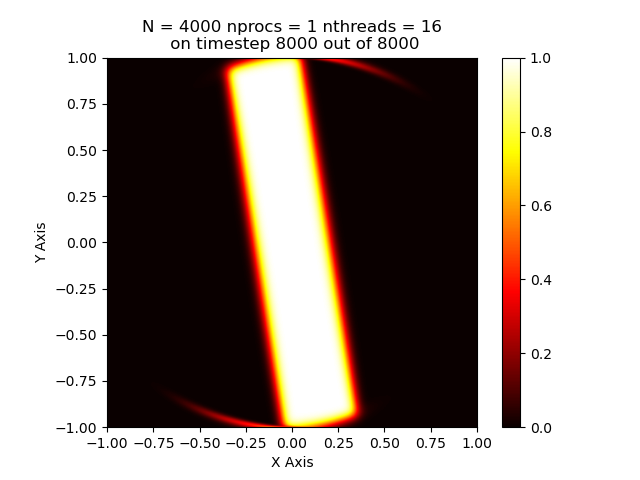
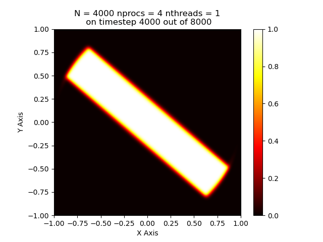
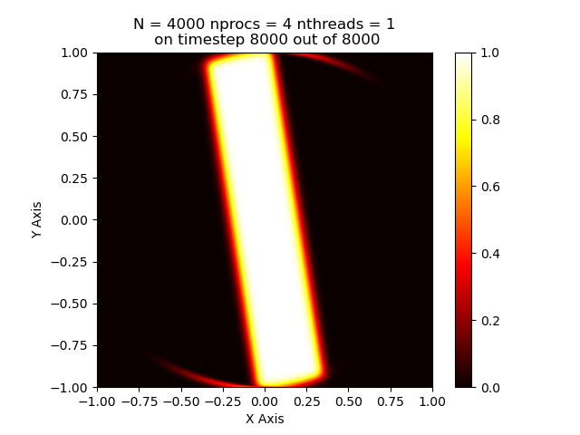
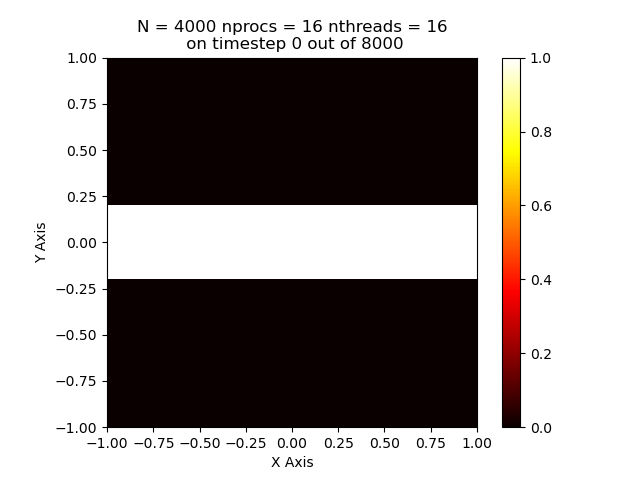

# Advection Simulation using MPI

## Code Structure and Implementation

The MPI + OpenMP implementation is achieved through a single `my_advection_program.c` file. The program takes the input of the various parameters from the CLI and then runs the algorithm as specified in the problem statement.

The flow of the program is as follows:

1. Take the input from the CLI and check if the number of arguments provided are correct. Open file `startend.dat` in rank 0 for writing to store the animation data and the start mid and end state, respectively
2. After taking in the required values from CLI, calculates `del_x`, `del_t` and `NT` for the simulation. If provided, then sets the number of threads and `del_t` to the provided value from CLI
3. Based on N and nprocs, calculate the number of rows and columns of the partitioning grid. The number of rows and columns are calculated closest to a perfect square. For eg for `nprocs` = 20, the grid is made in to a 4x5 grid
4. Dynamically makes three 2D arrays containing doubles. `C_n` represents the current time step, `C_n_1` represents the next timestep and `C_n_half` represents the array to store the state at half the timesteps. `C_n_half` is used to prevent I/O operations during the timesteps and hence give more relevant results
5. Initialize `C_n` with the given conditions and write the initialization to the output file by sending the ranks’ data to rank 0
6. Allocate 8 1D arrays, 4 for extracting and sending the 4 boundaries and 4 for receiving them
7. Run a loop for `NT` number of timsteps and calculate the next state using the current one. At the end of each timestep, swap the two arrays to prepare for the next timestep.
8. For every pair of adjacent ranks, use the x or y index, depending on if you are filling up left-right or up-down borders, and for the even indices, send first and then recieve, while for the odd ones, receive first and then send.
9. The update first fills up the border of the rank’s 2D array and then after that fills up the internal points concurrently.
10. After the timesteps are done, print total time and write mid and final grid state to output file
11. Frees the allocated memory


## Results

SBATCH -  the `result.sbatch` file generates the complete performance comparision table and the `plots.sbatch` generates all the required plots for the report. The `pyplot.sh` is a simple bash script to generate plots in the slurm cluster.

To compile and run the code run `make` on the command line. Then run the command.

```
module load openmpi
make
mpirun --bind-to none -n 16 ./my_advection_program [N] [L] [T] [u] [v] [nthreads] [del_t]
```
Sample run:

```console
$ mpirun --bind-to none -n 16 ./my_advection_program $n 1.0 1.0 1.414214 -1.414214 16 1.25e-4

max avail threads = 16
N = 4000	NT = 8000
nthreads = 16	nprocs = 16
Total time taken = 2.201009 seconds
```

Then run `make plot` to plot the obtained result. Three plots are made in the `results_final` directory.

### Serial Lax, N = 4000:
<div display="flex" flex-direction="row">


</div>

### Shared Memory Parallel Lax, N = 4000, ncores = 16 :
<div display="flex" flex-direction="row">



</div>

### Distributed Memory Parallel Lax, N = 4000, 1 core per node, 4 nodes.
<div display="flex" flex-direction="row">



</div>

### Distributed Memory Parallel Lax, N = 4000, 16 core per node, 16 nodes, hybrid 1 MPI rank per node
<div display="flex" flex-direction="row">



</div>


## Performance

|      **Programming Model**     | **Nodes** | **Cores Per Node** | **Execution Time (sec)** |
|:------------------------------:|:---------:|:------------------:|:------------------------:|
|               MPI              |     1     |          1         |          259.56          |
|               MPI              |    2x1    |          1         |          126.61          |
|               MPI              |    2x2    |          1         |           67.78          |
|               MPI              |    3x3    |          1         |           33.65          |
|               MPI              |    4x4    |          1         |           21.27          |
|             OpenMP             |     1     |          1         |          260.14          |
|             OpenMP             |     1     |          2         |          131.91          |
|             OpenMP             |     1     |          4         |            69            |
|             OpenMP             |     1     |          9         |           36.05          |
|             OpenMP             |     1     |         16         |           28.76          |
| One MPI rank per node (hybrid) |     1     |         16         |           28.62          |
| One MPI rank per node (hybrid) |    2x1    |         16         |           14.96          |
| One MPI rank per node (hybrid) |    2x2    |         16         |           6.53           |
| One MPI rank per node (hybrid) |    3x3    |         16         |           3.17           |
| One MPI rank per node (hybrid) |    4x4    |         16         |            2.2           |

### Observations

Fastest observed time is 2.2 seconds for 16 nodes and 16 cores MPI OpenMP Hybrid

The best time is a 118x speedup from the worst time of 260 seconds with one node and one thread configuration. The code has checks to avoid MPI send and receive if you are your left, right, top, or down neighbor. Additionally, the ghost cell and border filling code is implemented serially. Implementing ghost cell fillup increased the runtime, possibly due to parallelizing overhead of small for loops.

Interestingly, the 16 node 1 core time is lower than the 1 node 16 core time. Shared memory should be faster than a distributed run. Still, the ghost cell filling for the whole grid happening serially on a single node may take up significant time during each timestep and thus increase the overall time.
